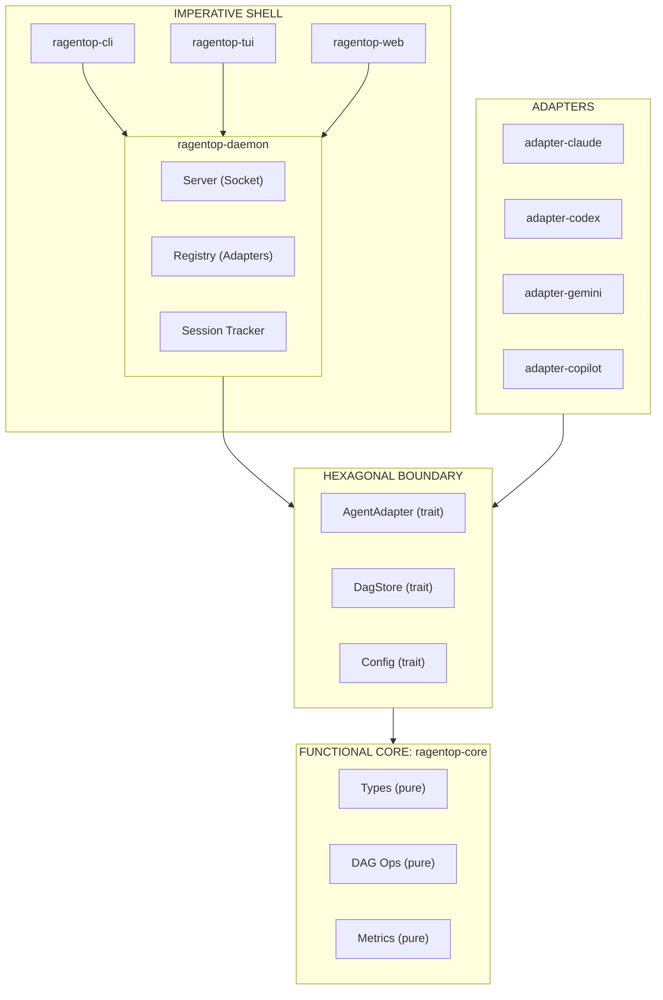

# ADR-001: Hybrid Hexagonal + Functional Core Architecture

**Date:** 2026-01-26
**Status:** Accepted
**Deciders:** Project maintainers

## Context

ragentop is a Rust-based monitoring tool for AI coding agents (Claude, Codex, Gemini, Copilot, Qwen, GLM). The project has specific architectural requirements:

1. **Plugin extensibility** - Open-source project needing clear contribution paths for new adapters
2. **Complex domain** - Merkle DAG storage, multi-agent normalization, session replay
3. **Infrastructure flexibility** - Each agent has different data sources (files, APIs, OTEL)
4. **Testability** - Core business logic must be testable without I/O

## Decision

We adopt a **Hybrid Architecture** combining:

1. **Hexagonal (Ports & Adapters)** for the adapter layer
2. **Functional Core, Imperative Shell** for the domain layer

### Architecture Overview



### Layer Responsibilities

| Layer | Crate(s) | Responsibility | Purity |
|-------|----------|----------------|--------|
| **Functional Core** | `ragentop-core` | Types, DAG operations, metrics calculation, business rules | Pure (no I/O) |
| **Ports** | `ragentop-core` | Trait definitions (`AgentAdapter`, `DagStore`) | Interfaces only |
| **Adapters** | `adapter-*` | Agent-specific data extraction | Impure (file/API I/O) |
| **Imperative Shell** | `ragentop-daemon`, `-cli`, `-tui`, `-web` | Orchestration, I/O, UI | Impure |

### Key Design Principles

1. **Core owns all decisions** - Business logic lives in `ragentop-core` as pure functions
2. **Adapters implement ports** - Each `adapter-*` crate implements the `AgentAdapter` trait
3. **Shell interprets commands** - Daemon orchestrates adapters, handles retries, emits events
4. **Dependencies point inward** - Adapters depend on core, never the reverse

## Consequences

### Positive

- **Clear plugin contribution path** - New adapters only need to implement `AgentAdapter` trait
- **Testable core** - 90%+ coverage target achievable with pure function tests
- **Infrastructure flexibility** - Can swap storage backends (sled → SQLite) without core changes
- **Rust trait system fit** - Traits naturally express ports; compile-time guarantees

### Negative

- **Learning curve** - Contributors must understand the layering rules
- **Indirection overhead** - More files/modules than a simple layered approach
- **Potential for logic drift** - Business logic could leak into shell; requires review discipline

### Mitigations

| Risk | Mitigation |
|------|------------|
| Logic drift | Code review checklist: "Does this belong in core?" |
| Port bloat | Group related ops into cohesive traits (per aggregate) |
| Adapter drift | Contract tests validate adapter behavior against trait |

## Alternatives Considered

### Pure Hexagonal
- **Rejected because:** Doesn't emphasize pure/impure separation in core domain

### Microkernel
- **Rejected because:** Dynamic plugin loading adds runtime complexity; static adapters sufficient for MVP

### Layered Architecture
- **Rejected because:** Doesn't provide clear adapter boundaries for plugin ecosystem

## Implementation Notes

### Workspace Structure

```
ragentop/
├── crates/
│   ├── ragentop-core/      # Functional core + port definitions
│   │   ├── src/
│   │   │   ├── types.rs    # Pure domain types
│   │   │   ├── dag/        # Pure DAG operations
│   │   │   ├── adapter.rs  # AgentAdapter trait (port)
│   │   │   └── error.rs    # Error types
│   │   └── tests/          # Unit tests (no I/O)
│   ├── ragentop-daemon/    # Imperative shell
│   ├── ragentop-tui/       # Driver (ratatui)
│   ├── ragentop-web/       # Driver (leptos)
│   ├── ragentop-cli/       # Driver (clap)
│   └── adapters/           # Driven adapters
│       ├── adapter-claude/
│       ├── adapter-codex/
│       └── ...
└── tests/                  # Integration tests
```

### Testing Strategy

| Layer | Test Type | Coverage Target |
|-------|-----------|-----------------|
| Core | Unit (pure functions) | 90% |
| Adapters | Contract + Integration | 85% |
| Shell | Integration | 70% |

## References

- [Hexagonal Architecture in Rust](https://www.howtocodeit.com/articles/master-hexagonal-architecture-rust)
- [Ports and Adapters in Rust — With Traits](https://medium.com/@bugsybits/ports-and-adapters-in-rust-but-with-traits-instead-of-pain-e88eabc09cb1)
- [Arroyo: Rust Plugin Systems](https://www.arroyo.dev/blog/rust-plugin-systems/)
- [Functional Core, Imperative Shell](https://www.destroyallsoftware.com/screencasts/catalog/functional-core-imperative-shell)
